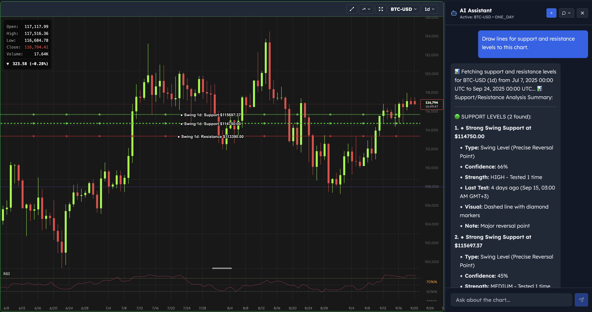

# Spot Canvas

A powerful web-based financial charting and analysis platform built with Remix and powered by the high-performance [rs-charts](https://www.npmjs.com/package/@anssip/rs-charts) charting library.


## Features

### Advanced Charting
- **Multi-chart layouts** - Arrange multiple charts in customizable grid layouts
- **Interactive drawing tools** - Trend lines, channels, and other technical analysis tools
- **Real-time data** - Live market data updates with smooth animations
- **Technical indicators** - Wide range of built-in indicators with customizable parameters


### Smart Analysis
- **AI-powered insights** - Get intelligent market analysis and trading suggestions
- **Pattern recognition** - Automated detection of chart patterns and trends



### Intuitive Interface
- **Fluid navigation** - Smooth panning and zooming across timeframes
- **Symbol management** - Easy switching between different trading symbols
- **Responsive design** - Works seamlessly on desktop and tablet devices


### Professional Tools
- **Drawing tools** - Complete set of technical analysis drawing tools
- **Customizable layouts** - Save and restore your preferred chart arrangements
- **User authentication** - Secure account management with Firebase Auth
- **Subscription tiers** - Flexible pricing plans for different user needs


## Documentation

- [Features Overview](docs/FEATURES.md) - Detailed feature descriptions
- [Chart API Reference](docs/CHART_API_REFERENCE.md) - API documentation for the charting library
- [Component Hierarchy](docs/COMPONENT_HIERARCHY.md) - Application architecture overview
- [Authentication](docs/AUTH.md) - User authentication and authorization
- [Firebase Usage](docs/FIREBASE_USAGE.md) - Firebase integration details

## Technology Stack

- **Frontend**: Remix, React, TypeScript
- **Charts**: [rs-charts](https://www.npmjs.com/package/@anssip/rs-charts) - High-performance charting library built with Rust/WebAssembly
- **Backend**: Firebase (Firestore, Functions, Auth)
- **Build Tool**: Bun

## Getting Started

### Prerequisites
- [Bun](https://bun.sh) installed on your system
- Firebase account and project

### Installation

```bash
# Clone the repository
git clone https://github.com/yourusername/sc-app.git
cd sc-app

# Install dependencies
bun install

# Start development server
bun dev
```

### Build Commands

```bash
# Development
bun dev

# Build for production
bun run build

# Run tests
bun test

# Lint code
bun run lint
```

## Environment Configuration

Create a `.env` file in the root directory with your Firebase and API credentials. See the documentation for detailed configuration instructions.

## Related Projects

This library is part of the Spot Canvas "ecosystem":

- [rc-charts – The charting library this app uses](https://github.com/anssip/rs-charts)
- [market-evaluators – Indicators backend for Spot Canvas and this library](https://github.com/anssip/market_evaluators)
- [spot-server – Price data ingestion](https://github.com/anssip/spot-server)

## Contributing

Contributions are welcome! Please feel free to submit a Pull Request.

## License

MIT

## Roadmap

- Custom user-defined indicators
- Indicator marketplace and sharing
- Visual indicator builder
- Strategy templates with pre-configured indicators
- Real-time indicator updates during live trading
- Performance optimizations and caching

## Support

For questions, issues, or feature requests, please open an issue on GitHub.
