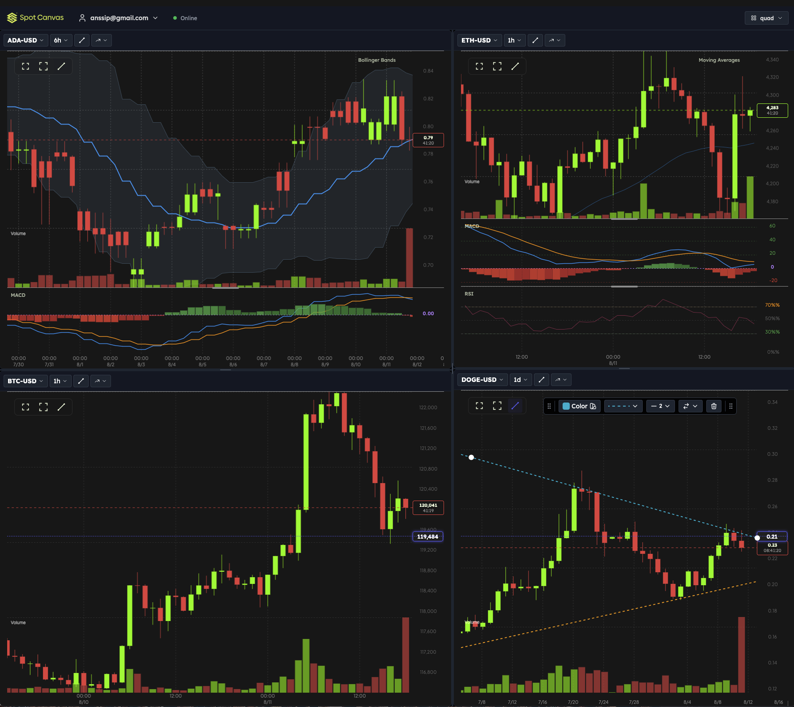
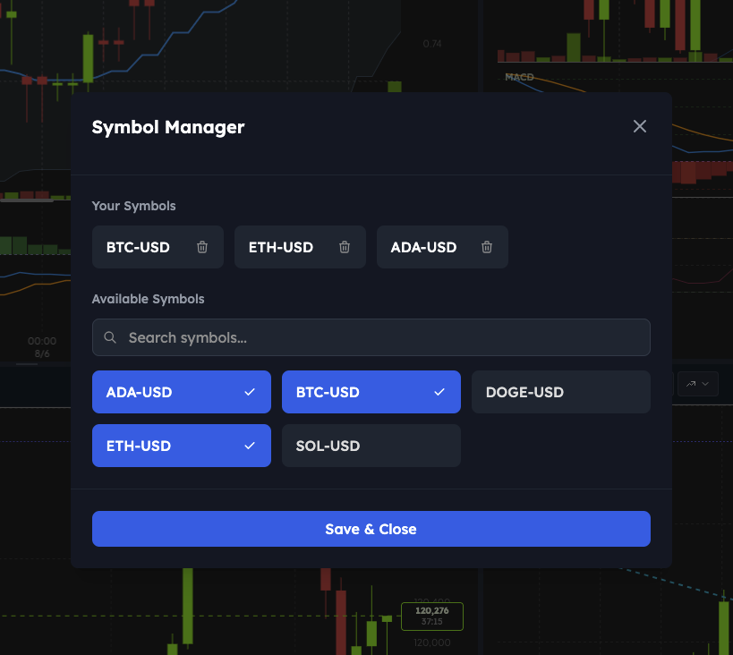
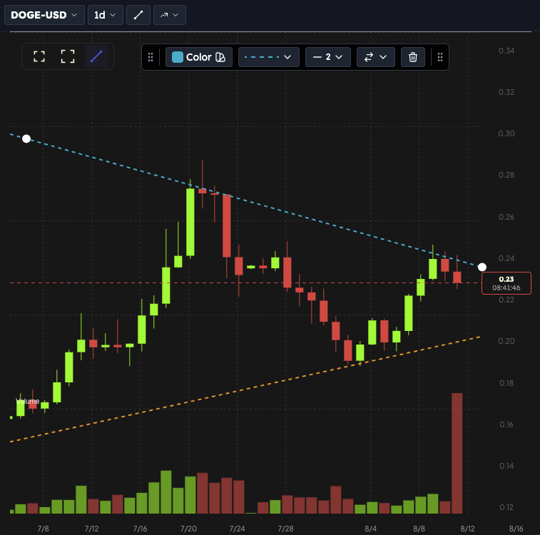
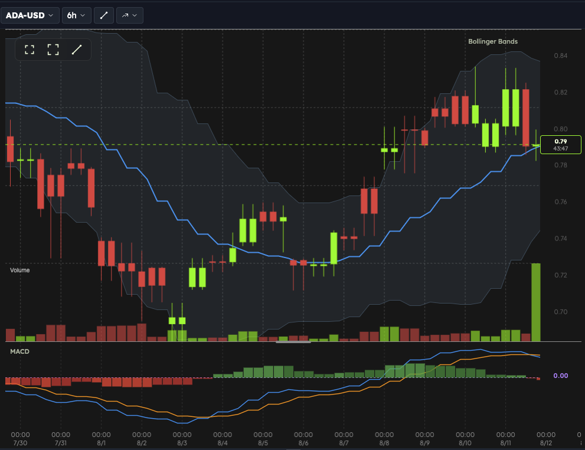

# SpotCanvas Features

SpotCanvas is a professional cryptocurrency charting platform designed for traders, market analysts and crypto enthusiasts. Our comprehensive suite of tools provides everything you need for technical analysis and market monitoring.

## 📊 Multi-Chart Layout Management

Create and manage multiple charts simultaneously with our flexible layout system:

- **Preset Layouts** - Quick access to single, double, triple, and quadruple chart configurations
- **Custom Layouts** - Create and save personalized chart arrangements
- **Resizable Panels** - Drag panel borders to adjust chart sizes
- **Nested Layouts** - Split panels horizontally or vertically for complex arrangements
- **Layout Persistence** - Save and restore your favorite layouts with all settings intact

## 💱 Symbol Management

Comprehensive cryptocurrency symbol tracking and management:

- **Extensive Coverage** - Access all major cryptocurrency pairs
- **Real-Time Data** - Live price updates via WebSocket connections
- **Favorites System** - Quick access to frequently traded pairs
- **Quick Search** - Fast symbol lookup with intelligent filtering
- **Multiple Timeframes** - View data from 15-minute to daily granularities
- **Cross-Chart Sync** - Symbol synchronization across multiple charts (coming soon)

## 📈 Trend Lines & Drawing Tools

Professional drawing tools for technical analysis:

- **Trend Lines** - Draw support and resistance lines with precision
- **Persistent Storage** - All drawings are automatically saved to the cloud
- **Chart-Specific** - Each chart maintains its own set of drawings
- **Multiple Line Styles** - Customize appearance for different analysis types
- **Snap-to-Price** - Automatic alignment to important price levels (coming soon)

## 📉 Technical Indicators

Complete suite of technical analysis indicators:

- **Moving Averages** - SMA and EMA with customizable periods
- **Oscillators** - RSI, MACD, and Stochastic indicators
- **Volatility Indicators** - Bollinger Bands and ATR
- **Volume Analysis** - Real-time volume tracking and visualization
- **Multi-Indicator Support** - Run multiple indicators simultaneously
- **Custom Parameters** - Adjust indicator settings to match your strategy (coming soon)
- **Create your own indicators** - Develop custom indicators using Python (coming soon)

## 🎯 Advanced Charting Features

### Chart Types & Visualization
- **Candlestick Charts** - Professional OHLC visualization
- **Interactive Crosshairs** - Precise price and time targeting
- **Zoom & Pan** - Smooth navigation through price history
- **Touch Support** - Full mobile and tablet compatibility
- **Chart Types** - Choose from various chart styles including Line, Area, and Bar charts (coming soon)

### Display Modes
- **Fullscreen Mode** - Immersive chart viewing experience
- **Full Window Mode** - Maximize chart within the application
- **Context Menus** - Right-click access to chart options
- **Resizable Indicator Panels** - Adjust panel heights to your preference

### Data & Performance
- **Real-Time Updates** - Live candlestick formation and price updates
- **High-Performance Rendering** - Canvas-based rendering for smooth performance
- **Historical Data** - Access extensive price history for analysis
- **Multiple Timeframes** - 1m, 5m, 15m, 30m, 1h, 2h, 6h, 1d granularities

## 🔧 Platform Integration

### API & Development (coming soon)
- **Chart API** - Programmatic control for external applications
- **TypeScript Support** - Full type definitions for developers
- **Event System** - Real-time notifications for state changes
- **React Components** - Ready-to-use components for integration

## 🚀 The Road Ahead: Professional Trading Tools and More

The tools in this section are under development and will be available during 2026.

### Market Analysis
- **Multi-Asset Comparison** - Compare multiple cryptocurrencies side-by-side
- **Price Alerts** - Set notifications for price movements
- **Pattern Recognition** - Identify chart patterns automatically
- **Strategy Backtesting** - Test trading strategies on historical data

### Data Management
- **Export Capabilities** - Export chart images and data
- **Custom Indicators** - Create and save custom technical indicators
- **Watchlists** - Organize symbols into custom watchlists
- **Notes & Annotations** - Add text annotations to charts

## 💼 Enterprise Features

- **Multi-Exchange Support** - Additional exchanges coming soon

## 🎨 Customization

- **Theme Support** - Light and dark themes
- **Custom Color Schemes** - Personalize chart appearance
- **Keyboard Shortcuts** - Efficient navigation and control

SpotCanvas combines professional-grade charting capabilities with an intuitive interface, making it the ideal platform for both novice and experienced cryptocurrency traders.
